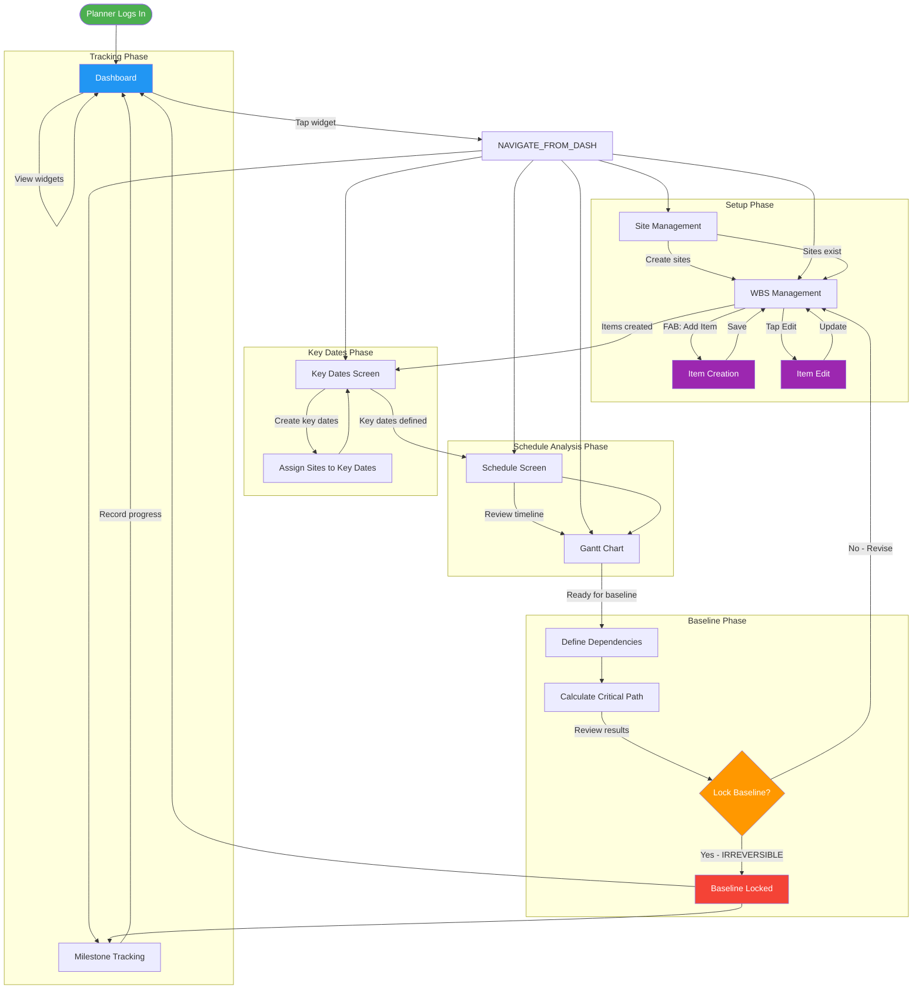
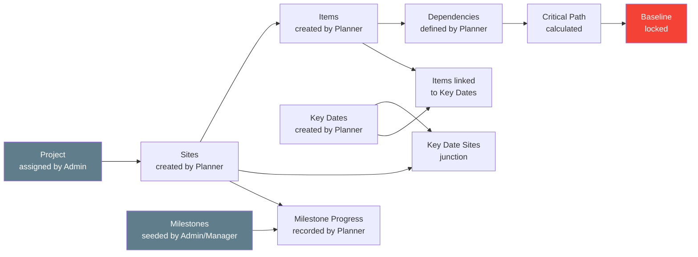

# Planning Module - Complete Action Flow

**Version**: v2.21
**Last Updated**: January 30, 2026
**Source of Truth**: Reconstructed from codebase analysis of `src/planning/`, `models/`, `services/planning/`, and `src/nav/PlanningNavigator.tsx`

---

## Table of Contents

- [Navigation Architecture](#navigation-architecture)
- [Part 1: Detailed Tab-Level Action Flow](#part-1-detailed-tab-level-action-flow)
  - [Dashboard](#1-dashboard)
  - [Key Dates Screen](#2-key-dates-screen)
  - [Schedule Screen](#3-schedule-screen)
  - [Gantt Screen](#4-gantt-screen)
  - [Site Management (Drawer)](#5-site-management-drawer)
  - [WBS Management (Drawer)](#6-wbs-management-drawer)
  - [Item Creation (Stack)](#7-item-creation-stack)
  - [Item Edit (Stack)](#8-item-edit-stack)
  - [Resource Planning (Drawer)](#9-resource-planning-drawer)
  - [Milestone Tracking (Drawer)](#10-milestone-tracking-drawer)
  - [Baseline Planning (Drawer)](#11-baseline-planning-drawer)
- [Part 2: Global Planning Workflow](#part-2-global-planning-workflow)
- [Part 3: Flow Diagram](#part-3-flow-diagram)
- [Part 4: README.md Update](#part-4-readmemd-update)
- [Part 5: ARCHITECTURE_UNIFIED.md Update](#part-5-architecture_unifiedmd-update)

---

## Navigation Architecture

The Planning role uses a three-tier hybrid navigation structure:

```
PlanningProvider (Context wrapping everything)
  |
  +-- Stack Navigator (PlanningStackParamList)
       |
       +-- "SiteManagement" -> Drawer Navigator
       |    |
       |    +-- "MainTabs" -> Bottom Tab Navigator
       |    |    +-- Dashboard (PlanningDashboard)
       |    |    +-- KeyDates (KeyDateManagementScreen)
       |    |    +-- Schedule (UnifiedSchedule)
       |    |    +-- Gantt (GanttChartScreen)
       |    |
       |    +-- "Resources" -> ResourcePlanningScreen
       |    +-- "Sites" -> SiteManagementScreen
       |    +-- "WBS" -> WBSManagementScreen
       |    +-- "CreateItem" -> ItemCreationScreen
       |    +-- "MilestoneTracking" -> MilestoneTrackingScreen
       |    +-- "Baseline" -> BaselineScreen
       |
       +-- "ItemCreation" -> ItemCreationScreen (params: siteId, parentWbsCode?)
       +-- "ItemEdit" -> ItemEditScreen (params: itemId)
```

**PlanningContext** (`src/planning/context/PlanningContext.tsx`) wraps the entire navigator and provides:
- `projectId` / `projectName` -- derived from the logged-in user's assigned project
- `selectedSiteId` / `selectedSite` -- currently selected site
- `sites` -- all sites for the assigned project
- `selectSite()` / `refreshSites()` / `refreshProject()` -- mutation methods
- Persists selections to `AsyncStorage` for offline session continuity

---

## Part 1: Detailed Tab-Level Action Flow

---

### 1. Dashboard

**File**: `src/planning/dashboard/PlanningDashboard.tsx`

#### Purpose
- Provides a high-level overview of the entire planning state for the assigned project
- Serves as the landing screen and entry point for the Planning role
- Aggregates data from items, progress logs, and milestones into 6 interactive widgets

#### User Actions
- Pull-to-refresh to reload all widget data
- Tap any widget to navigate to its corresponding detail screen:
  - Upcoming Milestones widget -> MilestoneTracking (drawer)
  - Schedule Overview widget -> Schedule (tab)
  - Resource Utilization widget -> Resources (drawer)
  - WBS Progress widget -> WBS (drawer)
  - Critical Path widget -> Gantt (tab)
- View user greeting with role identification

#### Action Sequence
1. Screen loads automatically on login (first tab)
2. PlanningContext resolves the user's assigned project from the `users` table
3. Six data hooks fire in parallel:
   - `useUpcomingMilestonesData()` -- queries `items` where `is_milestone=true`, not completed
   - `useCriticalPathData()` -- queries `items` where `is_critical_path=true`, not completed
   - `useScheduleOverviewData()` -- aggregates total/completed/delayed/on-track item counts
   - `useRecentActivitiesData()` -- queries `progress_logs` for latest 10 entries
   - `useResourceUtilizationData()` -- groups items by `project_phase`, calculates utilization
   - `useWBSProgressData()` -- groups items by `project_phase`, calculates per-phase completion
4. Widgets render with loading/error/data states via BaseWidget pattern

#### Data Flow
- **Tables READ**: `items` (via 5 hooks), `progress_logs` (via RecentActivities hook)
- **Tables WRITTEN**: None (read-only dashboard)
- **Key Fields**: `is_milestone`, `is_critical_path`, `status`, `planned_start_date`, `planned_end_date`, `project_phase`, `completed_quantity`, `planned_quantity`
- **Dependencies**: Requires items to exist (created via WBS Management / Item Creation)

#### Offline-First Behavior
- All data from local WatermelonDB -- fully available offline
- No sync queue interaction
- Pull-to-refresh triggers local database re-queries only

#### Navigation & Dependencies
- **Previous**: None (landing screen)
- **Next**: Any tab or drawer screen via widget taps
- **Hard Dependencies**: A project must be assigned to the user in the `users` table
- **Soft Dependencies**: Items should exist for meaningful widget data; otherwise shows empty states

#### Failure Modes & Edge Cases
- No project assigned: Shows "No Project Assigned" message
- No items exist: Widgets display zero counts or empty lists
- No progress logs: Recent Activities widget shows empty state

---

### 2. Key Dates Screen

**File**: `src/planning/key-dates/KeyDateManagementScreen.tsx`

#### Purpose
- Manages contract-level Key Dates based on CMRL contract structure
- Tracks target days from commencement, delay damages, and per-site progress
- Key Dates define contractual milestones that Items can be linked to

#### User Actions
- **Search**: Filter key dates by code, description, or category name (real-time)
- **Filter by Category**: Dropdown menu with 7 categories (G, A, B, C, D, E, F)
- **Filter by Status**: Segmented buttons (All / Not Started / In Progress / Delayed)
- **Clear Filters**: Reset all active filters
- **Create Key Date**: FAB button opens a dialog form
- **Edit Key Date**: Tap edit icon on card opens pre-populated dialog
- **Delete Key Date**: Tap delete icon with confirmation dialog
- **Manage Sites**: Tap sites icon on card opens KeyDateSiteManager dialog
  - Assign sites to key dates with contribution percentages
  - Set per-site planned/actual dates
  - Progress auto-calculated from linked supervisor item data

#### Action Sequence
1. Screen loads Key Dates for the assigned project via `withObservables`
2. User can search, filter by category, or filter by status
3. To create a key date:
   a. Tap FAB (+)
   b. Fill form: code, category (dropdown), category name, description, target days, sequence order, delay damages (initial/extended/special)
   c. Target date auto-calculated from project start date + target days
   d. Tap Save -- record created in `key_dates` table
4. To manage site assignments:
   a. Tap sites icon on a key date card
   b. KeyDateSiteManager dialog shows available sites
   c. Assign contribution percentages per site
   d. Set site-specific planned/actual dates
   e. Save creates/updates records in `key_date_sites` table

#### Data Flow
- **Tables READ**: `key_dates` (filtered by `project_id`), `projects` (for start date calculation), `key_date_sites` (via KeyDateSiteManager), `sites` (via KeyDateSiteManager)
- **Tables WRITTEN**: `key_dates` (CRUD), `key_date_sites` (CRUD)
- **Key Fields**: `code`, `category` (G/A/B/C/D/E/F), `target_days`, `target_date`, `status`, `progress_percentage`, `delay_damages_initial`, `delay_damages_extended`, `project_id`
- **Key Foreign Keys**: `key_dates.project_id` -> `projects.id`, `key_date_sites.key_date_id` -> `key_dates.id`, `key_date_sites.site_id` -> `sites.id`
- **Dependencies**: Requires project to exist; sites must exist for site assignments

#### Offline-First Behavior
- New `key_dates` records created with `appSyncStatus = 'pending'` and `version = 1`
- Uses WatermelonDB `withObservables` for reactive updates
- All operations write to local database first

#### Navigation & Dependencies
- **Previous**: Dashboard (tab)
- **Next**: Schedule (tab) or Gantt (tab)
- **Hard Dependencies**: Project must be assigned
- **Soft Dependencies**: Sites should exist before assigning sites to key dates

#### Failure Modes & Edge Cases
- No project assigned: Shows "No Project Assigned" message
- No key dates exist: Shows empty state with guidance text
- Delete with linked sites: Key date sites become orphaned (no cascade documented)
- Duplicate codes: No uniqueness enforcement in UI (**UNCERTAIN** -- validation may rely on manual entry)

---

### 3. Schedule Screen

**File**: `src/planning/schedule/UnifiedSchedule.tsx`

#### Purpose
- Provides three complementary views of the project schedule: Timeline, Calendar, and List
- Read-only visualization of Items data across sites and categories
- Supports filtering and searching to find specific schedule items

#### User Actions
- **Switch View**: Toggle between Timeline / Calendar / List tabs
- **Filter by Site**: Select a specific site or "All Sites"
- **Search**: Search items by name or category (debounced 300ms)
- **Toggle Critical Path**: Filter to show only critical path items
- **Clear Search**: Reset search input

#### Action Sequence
1. Screen loads all items, projects, sites, and categories via `withObservables`
2. Data filtered to the assigned project via PlanningContext
3. User selects a view mode (Timeline default)
4. User can narrow results by site, search query, or critical path toggle
5. Selecting a site updates the PlanningContext via `selectSite()`

#### Data Flow
- **Tables READ**: `items` (all), `projects` (all), `sites` (all), `categories` (all)
- **Tables WRITTEN**: None (read-only)
- **Key Fields**: `planned_start_date`, `planned_end_date`, `actual_start_date`, `actual_end_date`, `is_critical_path`, `status`, `name`, `site_id`, `category_id`
- **Dependencies**: Items must exist with schedule dates populated

#### Offline-First Behavior
- All data from local WatermelonDB via reactive `withObservables`
- No sync queue interaction
- Site selection persisted to PlanningContext (and AsyncStorage)

#### Navigation & Dependencies
- **Previous**: Key Dates (tab)
- **Next**: Gantt (tab)
- **Hard Dependencies**: Items must exist
- **Soft Dependencies**: Categories should exist for meaningful category-based search

#### Failure Modes & Edge Cases
- No items: Shows empty state per view
- Items without dates: Timeline and Calendar views may display incorrectly (**UNCERTAIN**)
- Large item counts (50+): Performance optimized with debounced search

---

### 4. Gantt Screen

**File**: `src/planning/GanttChartScreen.tsx`

#### Purpose
- Visual timeline representation of all items for a selected site
- Displays task bars with progress, critical path highlighting, and key date milestones
- Supports zoom levels (day/week/month) for different planning perspectives

#### User Actions
- **Select Site**: Choose a site via SimpleSiteSelector
- **Zoom In/Out**: Adjust timeline granularity (day, week, month) via ZoomControls
- **Scroll Timeline**: Horizontal scroll to navigate through the timeline
- **View Task Details**: Task bars show name, progress, and critical path status
- **View Key Date Milestones**: Diamond markers for key dates on the timeline

#### Action Sequence
1. Screen loads, user selects a site from SimpleSiteSelector
2. `useGanttData` hook queries `items` filtered by `site_id`, sorted by `planned_start_date` and `wbs_code`
3. Key dates loaded for the project from `key_dates` table
4. `useGanttTimeline` calculates timeline bounds, column positions, and today-marker
5. TaskRow components render bars positioned based on planned dates and progress
6. KeyDateMilestoneRow renders diamond markers at target dates

#### Data Flow
- **Tables READ**: `items` (filtered by `site_id`), `key_dates` (filtered by `project_id`), `sites` (via PlanningContext)
- **Tables WRITTEN**: None (visualization only)
- **Key Fields**: `planned_start_date`, `planned_end_date`, `completed_quantity`, `planned_quantity`, `is_critical_path`, `wbs_code`, `name`
- **Dependencies**: Items must exist with valid date ranges; key dates optional

#### Offline-First Behavior
- All data from local WatermelonDB
- No sync queue interaction
- State managed via `ganttChartReducer`

#### Navigation & Dependencies
- **Previous**: Schedule (tab)
- **Next**: Drawer screens (Sites, WBS, Resources, etc.)
- **Hard Dependencies**: At least one site must exist with items
- **Soft Dependencies**: Key dates enhance the visualization but are not required

#### Failure Modes & Edge Cases
- No site selected: Shows site selection prompt
- No items for site: Shows empty Gantt chart
- Items without dates: Bars cannot render -- excluded from timeline (**UNCERTAIN**)
- Very long timelines: Horizontal scroll handles this; zoom controls help manage scale

---

### 5. Site Management (Drawer)

**File**: `src/planning/SiteManagementScreen.tsx`

#### Purpose
- Create and manage construction sites within the assigned project
- Assign supervisors to sites
- Set planned and actual date ranges for site-level scheduling
- This is the foundation step -- sites are required before any other planning data

#### User Actions
- **Add Site**: Opens dialog with form fields
- **Edit Site**: Tap pencil icon to modify existing site
- **Delete Site**: Tap trash icon with confirmation dialog
- **Assign Supervisor**: Select from available supervisors via picker

#### Action Sequence
1. Screen loads sites for the assigned project via `withObservables`
2. Supervisor names resolved by querying `users` table by `supervisor_id`
3. To create a site:
   a. Tap "Add Site" button
   b. Fill form: name, location, project (pre-selected), supervisor (optional picker), planned start/end dates, actual start/end dates
   c. Tap Save -- record created in `sites` table
4. To edit: Tap pencil icon, modify fields, Save
5. To delete: Tap trash icon, confirm in dialog, site marked as deleted

#### Data Flow
- **Tables READ**: `sites` (filtered by `project_id`), `projects` (all), `users` (supervisor lookup)
- **Tables WRITTEN**: `sites` (create, update, delete via `markAsDeleted()`)
- **Key Fields**: `name`, `location`, `project_id`, `supervisor_id`, `planned_start_date`, `planned_end_date`, `actual_start_date`, `actual_end_date`
- **Key Foreign Keys**: `sites.project_id` -> `projects.id`, `sites.supervisor_id` -> `users.id`
- **Dependencies**: Project must exist (provided by PlanningContext)

#### Offline-First Behavior
- Direct WatermelonDB writes to local database
- No explicit `appSyncStatus` set on creation (relies on model defaults)
- Reactive via `withObservables`

#### Navigation & Dependencies
- **Previous**: Any tab (accessed via drawer)
- **Next**: WBS Management (to create items for the site)
- **Hard Dependencies**: Project must be assigned to the planner
- **Soft Dependencies**: Users with supervisor role should exist for assignment

#### Failure Modes & Edge Cases
- No project assigned: Shows "No Project Assigned" message
- No supervisors available: Picker shows empty list; supervisor assignment is optional
- Deleting a site with items: Items become orphaned (**UNCERTAIN** -- no cascade delete confirmed in UI code)

---

### 6. WBS Management (Drawer)

**File**: `src/planning/WBSManagementScreen.tsx`

#### Purpose
- Manage the Work Breakdown Structure (WBS) for a selected site
- Provides hierarchical item listing with search, filter, and sort capabilities
- Entry point for creating and editing items (work packages)
- Enforces baseline lock -- prevents edits to locked items

#### User Actions
- **Select Site**: Choose from available sites
- **Search**: By name or WBS code (debounced 300ms)
- **Filter by Phase**: 11 construction phases + "All"
- **Filter by Status**: All / Not Started / In Progress / Completed
- **Filter Critical Path**: Toggle to show only critical path items
- **Sort**: By WBS code, Name, Duration, or Progress (ascending/descending)
- **Clear Filters**: Reset all active filters
- **Add Item**: FAB navigates to ItemCreation with `siteId`
- **Edit Item**: Navigate to ItemEdit with `itemId` (blocked if baseline locked)
- **Add Child Item**: Navigate to ItemCreation with `siteId` + `parentWbsCode` (blocked if locked or level >= 4)
- **Delete Item**: Confirmation dialog, uses `destroyPermanently()` (blocked if baseline locked)

#### Action Sequence
1. User selects a site from SimpleSiteSelector
2. Items loaded from `items` table filtered by `site_id`
3. On load, item statuses auto-corrected to match progress percentages:
   - 0% -> `not_started`
   - 100% -> `completed`
   - 1-99% -> `in_progress`
4. User applies search, filters, or sorting as needed
5. Tap FAB to create new root item -> navigates to ItemCreation
6. On WBSItemCard, actions available based on lock state:
   - Edit -> ItemEdit screen (if not locked)
   - Add Child -> ItemCreation with parent code (if not locked and level < 4)
   - Delete -> Permanent deletion with confirmation (if not locked)
7. After returning from ItemCreation/ItemEdit, list auto-refreshes

#### Data Flow
- **Tables READ**: `items` (filtered by `site_id`), `sites` (via PlanningContext)
- **Tables WRITTEN**: `items` (status fix-up on load, delete via `destroyPermanently()`)
- **Key Fields**: `wbs_code`, `wbs_level`, `parent_wbs_code`, `name`, `status`, `project_phase`, `is_critical_path`, `is_baseline_locked`, `planned_quantity`, `completed_quantity`
- **Dependencies**: Site must exist (created via Site Management)

#### Offline-First Behavior
- Direct WatermelonDB reads/writes
- Status corrections applied locally on load
- Uses `useDebounce` for search optimization
- State managed via `wbsManagementReducer`

#### Navigation & Dependencies
- **Previous**: Site Management (to create sites first)
- **Next**: Item Creation / Item Edit (stack screens), then Baseline (to lock plan)
- **Hard Dependencies**: At least one site must exist
- **Soft Dependencies**: Categories should exist for item creation

#### Failure Modes & Edge Cases
- No sites: Shows site selection prompt with empty state
- No items for site: Shows empty state with "Add Item" guidance
- Baseline locked items: Edit/Delete/Add Child actions disabled with visual indicator
- Level 4 items: "Add Child" action hidden (max depth enforced)
- Delete item with children: Children are NOT automatically deleted (**UNCERTAIN** -- `destroyPermanently()` only deletes the target item)

---

### 7. Item Creation (Stack)

**File**: `src/planning/ItemCreationScreen.tsx`

#### Purpose
- Create new WBS items (work packages) with full planning details
- Auto-generates WBS codes based on hierarchy position
- Supports root-level and child item creation
- Links items to key dates for contractual tracking

#### User Actions
- **Select Site**: If not pre-selected from route params
- **View WBS Code**: Auto-generated (read-only display)
- **Enter Item Name**: Required field
- **Select Category**: From database-driven dropdown
- **Select Phase**: From 11 construction phases
- **Link Key Date**: Optional, filtered by project
- **Set Schedule**: Start date, end date, duration (auto-calculated between any two)
- **Set Quantity**: Planned quantity, completed quantity, unit, weightage
- **Toggle Milestone**: Mark as milestone item
- **Toggle Critical Path**: Mark on critical path
- **Set Float Days**: Total float for scheduling
- **Set Risk**: Dependency risk level (low/medium/high) and risk notes
- **Save**: Validates and creates the item record

#### Action Sequence
1. Screen receives `siteId` and optional `parentWbsCode` from route params
2. WBS code auto-generated:
   - If `parentWbsCode` provided: `WBSCodeGenerator.generateChildCode(siteId, parentWbsCode)`
   - If no parent: `WBSCodeGenerator.generateRootCode(siteId)`
3. WBS level calculated from code
4. User fills in form sections (all modular components)
5. Date calculations: changing any two of start/end/duration auto-computes the third
6. On Save:
   a. Form validated (name required, dates valid, quantities non-negative)
   b. Item record created in `items` table with all fields
   c. `created_by_role` set to `'planner'`
   d. Navigation goes back to WBS Management
   e. Snackbar confirms success

#### Data Flow
- **Tables READ**: `items` (indirectly via WBSCodeGenerator for code uniqueness), `key_dates` (for linking), `categories` (for picker)
- **Tables WRITTEN**: `items` (create new record)
- **Key Fields Written**: `name`, `category_id`, `site_id`, `wbs_code`, `wbs_level`, `parent_wbs_code`, `project_phase`, `planned_start_date`, `planned_end_date`, `planned_quantity`, `completed_quantity`, `unit_of_measurement`, `weightage`, `is_milestone`, `is_critical_path`, `float_days`, `dependency_risk`, `risk_notes`, `key_date_id`, `created_by_role`, `status`
- **Dependencies**: Site must exist; categories should exist

#### Offline-First Behavior
- Creates item in local WatermelonDB
- No explicit `appSyncStatus` set (relies on model defaults)
- WBS code generation queries local database for uniqueness

#### Navigation & Dependencies
- **Previous**: WBS Management (navigates back on save/cancel)
- **Next**: Returns to WBS Management
- **Hard Dependencies**: Site must exist, WBSCodeGenerator must find valid codes
- **Soft Dependencies**: Categories, Key Dates

#### Failure Modes & Edge Cases
- No categories: Category picker shows empty list
- WBS code collision: Generator queries existing codes to avoid duplicates
- Invalid dates (end before start): Validation catches this
- Missing required fields: Save button validates and shows errors

---

### 8. Item Edit (Stack)

**File**: `src/planning/ItemEditScreen.tsx`

#### Purpose
- Edit existing WBS items with all planning details
- Respects baseline lock -- entire form becomes read-only when locked
- Auto-calculates status from progress percentage

#### User Actions
- **View WBS Code**: Read-only display
- **Edit Item Name**: Text field (disabled if locked)
- **Edit Category/Phase**: Dropdowns (disabled if locked)
- **Edit Schedule**: Start/end/duration with auto-calculation (disabled if locked)
- **Edit Quantities**: Planned/completed quantity, unit, weightage (disabled if locked)
- **Toggle Milestone/Critical Path**: Switches (disabled if locked)
- **Edit Risk**: Level and notes (disabled if locked)
- **Link/Unlink Key Date**: Picker (disabled if locked)
- **Update**: Validates and saves changes

#### Action Sequence
1. Screen receives `itemId` from route params
2. Item loaded from `items` table by ID
3. If `isBaselineLocked`, LockedBanner displayed and all fields disabled
4. User modifies fields as needed
5. Status auto-calculated from progress: 0% = not_started, 100% = completed, else in_progress
6. On Update:
   a. Form validated
   b. Item record updated in `items` table
   c. Baseline fields only updated if item is NOT locked
   d. Navigation goes back
   e. Snackbar confirms success

#### Data Flow
- **Tables READ**: `items` (find by `itemId`)
- **Tables WRITTEN**: `items` (update existing record)
- **Key Fields**: Same as Item Creation, plus `baseline_start_date`, `baseline_end_date` (only if not locked)
- **Dependencies**: Item must exist

#### Offline-First Behavior
- Direct WatermelonDB update to local database
- No explicit sync queue interaction

#### Navigation & Dependencies
- **Previous**: WBS Management (navigates back on save/cancel)
- **Next**: Returns to WBS Management
- **Hard Dependencies**: Item must exist
- **Soft Dependencies**: Categories, Key Dates

#### Failure Modes & Edge Cases
- Item not found: Error handling with snackbar
- Baseline locked: Form disabled with LockedBanner explanation
- Concurrent edit: Last write wins (WatermelonDB default)

---

### 9. Resource Planning (Drawer)

**File**: `src/planning/ResourcePlanningScreen.tsx`

#### Purpose
- Intended for resource allocation planning (manpower, equipment, materials)
- **Currently a stub/placeholder** -- displays EmptyState component only

#### User Actions
- None available (stub screen)

#### Action Sequence
- Screen renders with EmptyState message: "Plan and allocate resources for construction activities"

#### Data Flow
- **Tables READ**: None
- **Tables WRITTEN**: None
- **Dependencies**: None

#### Offline-First Behavior
- N/A (no data interaction)

#### Navigation & Dependencies
- **Previous**: Any screen (accessed via drawer)
- **Next**: N/A
- **Hard Dependencies**: None
- **Soft Dependencies**: None

#### Failure Modes & Edge Cases
- Always shows empty state (by design -- future implementation planned)

---

### 10. Milestone Tracking (Drawer)

**File**: `src/planning/MilestoneTrackingScreen.tsx`

#### Purpose
- Track progress on project milestones per site
- Record milestone progress percentages, dates, and status
- Mark milestones as achieved

#### User Actions
- **Select Project/Site**: Via ProjectSiteSelector
- **View Milestone Cards**: Cards show milestone details and progress
- **Edit Progress**: Dialog with percentage slider, status, notes, planned/actual dates
- **Mark as Achieved**: One-tap action sets progress to 100%, status to completed, actual end date to now

#### Action Sequence
1. Screen loads milestones for the assigned project via `withObservables`
2. User selects project and site via ProjectSiteSelector
3. `useMilestoneData` hook loads `milestone_progress` records filtered by project/site
4. Milestone cards render with current progress
5. To edit progress:
   a. Tap edit on a milestone card
   b. EditProgressDialog opens with slider (0-100%), status picker, date pickers, notes field
   c. Save creates new `milestone_progress` record or updates existing
6. To mark as achieved:
   a. Tap "Mark as Achieved" button
   b. Sets `progressPercentage = 100`, `status = 'completed'`, `actualEndDate = Date.now()`

#### Data Flow
- **Tables READ**: `milestones` (filtered by `project_id`, `is_active=true`), `sites` (filtered by `project_id`), `projects`, `milestone_progress` (filtered by milestone/site)
- **Tables WRITTEN**: `milestone_progress` (create or update)
- **Key Fields**: `milestone_id`, `site_id`, `project_id`, `progress_percentage`, `status` (not_started/in_progress/completed/on_hold), `planned_start_date`, `planned_end_date`, `actual_start_date`, `actual_end_date`, `notes`
- **Key Foreign Keys**: `milestone_progress.milestone_id` -> `milestones.id`, `milestone_progress.site_id` -> `sites.id`, `milestone_progress.project_id` -> `projects.id`
- **Dependencies**: Milestones must be seeded (created by Admin/Manager), Sites must exist

#### Offline-First Behavior
- New `milestone_progress` records created with `appSyncStatus = 'pending'` and `version = 1`
- Updates set `updatedBy = 'planner'` and `updatedAt = Date.now()`
- Reactive via `withObservables`

#### Navigation & Dependencies
- **Previous**: Any screen (accessed via drawer)
- **Next**: N/A (end-of-flow tracking)
- **Hard Dependencies**: Project must be assigned; milestones must exist
- **Soft Dependencies**: Sites should exist for per-site tracking

#### Failure Modes & Edge Cases
- No project assigned: Shows "No Project Assigned" message
- No milestones: Shows empty state (milestones are seeded by admin/manager, not planner)
- No sites: Site selector empty; progress cannot be tracked per site

---

### 11. Baseline Planning (Drawer)

**File**: `src/planning/BaselineScreen.tsx`

#### Purpose
- Calculate critical path across all project items
- Lock the baseline schedule (irreversible operation)
- Manage item dependencies
- This is the culmination of the planning process -- locking the plan

#### User Actions
- **Select Project**: Via ProjectSelector dropdown
- **Calculate Critical Path**: Button invokes PlanningService algorithm
- **Lock Baseline**: Button with confirmation dialog (irreversible)
- **Manage Dependencies**: Per-item dependency modal
- **View Critical Path**: Items highlighted with red borders

#### Action Sequence
1. Screen loads all projects and items via `withObservables`
2. User selects a project from ProjectSelector
3. Items for that project loaded via `Q.on('sites', 'project_id', selectedProject.id)`
4. **Calculate Critical Path**:
   a. Tap "Calculate Critical Path" button
   b. `PlanningService.calculateCriticalPath(projectId)` executes:
      - Parses item dependencies (JSON arrays)
      - Validates no circular dependencies (DFS)
      - Runs Kahn's algorithm (topological sort)
      - Forward pass: calculates earliest start/finish
      - Backward pass: calculates latest start/finish
      - Items with zero slack marked as critical path
   c. Updates `criticalPathFlag` on all items in the database
   d. UI refreshes to show red-bordered critical path items
   e. Result dialog shows count and total project duration
5. **Manage Dependencies**:
   a. Tap dependency icon on an item card
   b. DependencyModal opens with search and multi-select
   c. Select/deselect predecessor items
   d. Save updates the item's `dependencies` JSON field
6. **Lock Baseline** (IRREVERSIBLE):
   a. Tap "Lock Baseline" button
   b. Confirmation dialog warns this cannot be undone
   c. On confirm, `PlanningService.lockBaseline(projectId)` executes:
      - Copies `plannedStartDate` -> `baselineStartDate` for all items
      - Copies `plannedEndDate` -> `baselineEndDate` for all items
      - Sets `isBaselineLocked = true` for all items
   d. All items become read-only in WBS Management and Item Edit screens
   e. Variance tracking enabled (baseline vs actual)

#### Data Flow
- **Tables READ**: `projects` (all, via observable), `items` (filtered by project via sites join)
- **Tables WRITTEN**: `items` (critical path flags via calculateCriticalPath; baseline dates and lock via lockBaseline)
- **Key Fields Written**: `critical_path_flag`, `is_critical_path`, `baseline_start_date`, `baseline_end_date`, `is_baseline_locked`, `dependencies`
- **Dependencies**: Items must exist with valid dates and dependencies defined

#### Offline-First Behavior
- PlanningService writes to local WatermelonDB
- All calculations run locally (no server dependency)
- Baseline lock is a local database operation

#### Navigation & Dependencies
- **Previous**: WBS Management (items must be fully defined)
- **Next**: Milestone Tracking (track against the locked baseline), Dashboard (view progress)
- **Hard Dependencies**: Items must exist with `planned_start_date` and `planned_end_date` populated
- **Soft Dependencies**: Dependencies should be defined for meaningful critical path calculation

#### Failure Modes & Edge Cases
- No items: Critical path calculation returns empty result
- Circular dependencies: `validateDependencies()` detects and reports cycles
- Items without dates: Excluded from critical path calculation (**UNCERTAIN** -- behavior depends on PlanningService null handling)
- Already locked: Lock button state after locking (**UNCERTAIN** -- may still be visible but items already locked)
- Partial data: Items without dependencies are treated as independent nodes (zero or full float)

---

## Part 2: Global Planning Workflow

### Planning Workflow Overview

#### Ideal End-to-End Planning Sequence

The Planning role follows a logical sequence to build a complete project plan:

```
1. SETUP PHASE
   a. Site Management: Create sites, assign supervisors, set site dates
   b. WBS Management: Create work items with WBS hierarchy (up to 4 levels)
   c. Item Creation: Define each work package (schedule, quantities, phases, risk)

2. KEY DATES PHASE
   d. Key Dates: Define contractual key dates with categories and target days
   e. Key Date Site Assignment: Link key dates to sites with contribution percentages
   f. Item-Key Date Linking: Link items to key dates during creation/edit

3. SCHEDULE ANALYSIS PHASE
   g. Schedule Screen: Review schedule across Timeline/Calendar/List views
   h. Gantt Chart: Visualize timeline with zoom levels and critical path

4. BASELINE PHASE (Partially Irreversible)
   i. Baseline - Dependencies: Define item dependencies (predecessors)
   j. Baseline - Critical Path: Calculate critical path (reversible -- can recalculate)
   k. Baseline - Lock: Lock the baseline (IRREVERSIBLE -- copies planned to baseline dates)

5. TRACKING PHASE
   l. Milestone Tracking: Record progress against milestones per site
   m. Dashboard: Monitor overall project health via widgets
```

#### Irreversible Steps

| Step | Reversibility | Impact |
|------|--------------|--------|
| Create Site | Reversible (can delete if no items linked) | Foundation for all items |
| Create Item | Reversible (can delete if not baseline-locked) | Work package definition |
| Create Key Date | Reversible (can delete) | Contractual milestone |
| Calculate Critical Path | Reversible (can recalculate) | Updates item flags |
| **Lock Baseline** | **IRREVERSIBLE** | Copies planned dates to baseline fields, disables editing on all project items |
| Record Milestone Progress | Reversible (can update) | Progress tracking |

#### Steps Safe to Revisit

- **Dashboard**: Always safe (read-only)
- **Key Dates**: Can add/edit/delete key dates at any time (before or after baseline lock)
- **Schedule and Gantt**: Always safe (read-only views)
- **WBS Management**: Safe to add new items; editing/deleting blocked after baseline lock
- **Milestone Tracking**: Can always update progress
- **Resource Planning**: N/A (stub)

#### Where Planners Commonly Break the Flow

1. **Creating items without dates**: Items missing `planned_start_date` or `planned_end_date` will not appear correctly in Schedule, Gantt, or critical path calculations
2. **Locking baseline prematurely**: Once locked, no item schedule changes are possible; all items become read-only
3. **Not defining dependencies before critical path**: Without dependencies, critical path calculation treats all items as independent and every item appears on the critical path
4. **Creating items without a site**: Items require a `site_id`; site must be created first via Site Management
5. **Skipping key date assignment**: Items not linked to key dates miss contractual tracking; this is optional but important for delay damage visibility

#### Design Intent vs Actual Enforcement

| Intent | Enforcement | Gap |
|--------|------------|-----|
| Sites created before items | **Enforced**: Item creation requires `siteId` parameter | None |
| Dependencies defined before critical path | **Not enforced**: Critical path can be calculated without dependencies (produces meaningless result) | UI should warn when no dependencies exist |
| Items have dates before Gantt/Schedule | **Not enforced**: Views handle items without dates via exclusion or empty display | Could show a warning |
| Baseline locked once planning is complete | **Enforced**: Lock is irreversible with confirmation dialog | No unlock mechanism exists |
| Key dates created before item linking | **Enforced**: Key date picker only shows existing key dates | None |
| Milestones seeded before tracking | **Not enforced by planner**: Milestones are created by Admin/Manager role, not the planner | Planner depends on another role |

---

## Part 3: Flow Diagram



### Data Prerequisite Chain



---

## Part 4: README.md Update

The following section is intended to replace the Planning Module bullet under `### Key Features` in README.md:

---

### Planning Module Overview

The Planning module provides comprehensive project planning capabilities for construction projects. It follows an offline-first architecture using WatermelonDB and supports the full planning lifecycle from site creation through baseline locking and milestone tracking.

**Role Responsibility**: The Planner creates the project plan (sites, WBS items, schedules, key dates) and locks the baseline. Supervisors then execute against this plan by recording daily progress.

**Navigation Structure**: 4 bottom tabs + 6 drawer screens + 2 stack screens

**Bottom Tabs** (primary workflow screens):
1. **Dashboard** -- Overview widgets showing milestones, critical path, schedule health, WBS progress, resource utilization, and recent activities
2. **Key Dates** -- Contract-level key date management with CMRL categories (G/A/B/C/D/E/F), delay damages tracking, and per-site assignments
3. **Schedule** -- Three-view schedule visualization (Timeline, Calendar, List) with site/critical-path filtering
4. **Gantt Chart** -- Interactive Gantt timeline with zoom controls (day/week/month), critical path highlighting, and key date milestones

**Drawer Screens** (setup and management):
5. **Site Management** -- Create sites, assign supervisors, set planned/actual dates
6. **WBS Management** -- Hierarchical Work Breakdown Structure (4 levels), search, filter, sort, with baseline lock enforcement
7. **Item Creation** -- Full item form with auto-generated WBS codes, 11 phases, key date linking, risk assessment
8. **Resource Planning** -- Planned for future implementation (stub)
9. **Milestone Tracking** -- Per-site milestone progress recording with achievement marking
10. **Baseline Planning** -- Critical path calculation (Kahn's algorithm), dependency management, and irreversible baseline locking

**Workflow Summary**: Sites -> Items (WBS) -> Key Dates -> Schedule Review -> Dependencies -> Critical Path -> Lock Baseline -> Track Milestones

See `docs/implementation/planning-module/PLANNING_WORKFLOW.md` for the complete action flow documentation.

---

## Part 5: ARCHITECTURE_UNIFIED.md Update

The following section is intended to replace the Planning Module Features section in ARCHITECTURE_UNIFIED.md:

---

### Planning Module Architecture

#### Role Responsibility Boundaries

| Responsibility | Owner | Notes |
|---------------|-------|-------|
| Create projects | Admin | Planner is assigned to a project |
| Create sites | Planner | Sites belong to the assigned project |
| Assign supervisors to sites | Planner | Sets `supervisor_id` on sites |
| Create WBS items | Planner | Items belong to a site |
| Define key dates | Planner | Key dates belong to a project |
| Define item dependencies | Planner | JSON array of item IDs |
| Calculate critical path | Planner | PlanningService algorithm |
| Lock baseline | Planner | Irreversible operation |
| Create milestones | Admin/Manager | Planner cannot create milestones |
| Record milestone progress | Planner | Creates `milestone_progress` records |
| Record daily progress | Supervisor | Creates `progress_logs` against items |
| Report hindrances | Supervisor | Creates `hindrances` against items/sites |

#### Interaction with Database, SyncService, and Other Roles

**Database Layer**: All planning screens use WatermelonDB directly via `database.write()` and `database.collections.get()`. Reactive data binding via `withObservables` HOC pattern.

**PlanningService** (`services/planning/PlanningService.ts`): Singleton service providing:
- Critical path calculation (Kahn's algorithm with forward/backward pass)
- Progress metrics aggregation
- Schedule variance calculation
- Forecast generation (linear regression on progress_logs)
- Dependency validation (circular dependency detection via DFS)
- Baseline locking (copies planned dates to baseline fields)
- Schedule revision creation
- Impact analysis (recursive cascade calculation)

**WBSCodeGenerator** (`services/planning/WBSCodeGenerator.ts`): Static utility for hierarchical WBS code management (4-level codes like 1.2.3.4).

**PlanningContext** (`src/planning/context/PlanningContext.tsx`): Wraps entire navigator, provides project/site state with AsyncStorage persistence.

**Cross-Role Data Flow**:
- Planner creates Items -> Supervisor logs Progress against Items
- Planner creates Sites -> Supervisor is assigned and manages daily reports
- Planner links Items to Key Dates -> Key Date progress auto-calculated from supervisor item data
- Admin/Manager creates Milestones -> Planner records Milestone Progress

#### Data Ownership Rules

| Table | Created By | Updated By | Read By |
|-------|-----------|------------|---------|
| `sites` | Planner | Planner | All roles |
| `items` | Planner | Planner (plan), Supervisor (progress) | All roles |
| `key_dates` | Planner | Planner | All roles |
| `key_date_sites` | Planner | Planner | All roles |
| `milestones` | Admin/Manager | Admin/Manager | Planner (read-only) |
| `milestone_progress` | Planner | Planner | All roles |
| `schedule_revisions` | PlanningService | PlanningService | Planner |
| `progress_logs` | Supervisor | Supervisor | Planner (read via Dashboard) |

#### Offline-First Guarantees

1. **All reads are local**: Every query hits the local WatermelonDB (SQLite) database. No network dependency for reads.
2. **All writes are local-first**: Records are created/updated in the local database immediately. No write operation blocks on network.
3. **Sync status tracking**: New records in `key_dates` and `milestone_progress` explicitly set `appSyncStatus = 'pending'` and `version = 1`. Other tables rely on model defaults.
4. **Session persistence**: PlanningContext persists `projectId`, `projectName`, and `selectedSiteId` to AsyncStorage, surviving app restarts.
5. **Reactive UI**: Screens using `withObservables` automatically reflect local database changes without manual refresh.
6. **No network-dependent operations**: Critical path calculation, baseline locking, and all CRUD operations execute entirely against local data.

#### Architectural Invariants (Must Never Be Violated)

1. **Baseline lock is irreversible**: Once `isBaselineLocked = true`, no mechanism exists to unlock. This is by design -- the baseline is the reference point for all variance tracking.
2. **WBS codes are unique per site**: `WBSCodeGenerator` enforces uniqueness within a site scope.
3. **WBS hierarchy is limited to 4 levels**: Codes follow the format `X.Y.Z.W` where each segment represents a level.
4. **Items require a site**: Every item belongs to exactly one site via `site_id`. Items cannot exist without a site.
5. **Key dates belong to a project**: Every key date requires a `project_id`.
6. **Planner is assigned to exactly one project**: PlanningContext resolves the project from the user's `projectId` field.
7. **Critical path depends on dependencies**: Without defined dependencies, all items are independent and the algorithm produces a meaningless result.
8. **Status is derived from progress**: WBS Management auto-corrects item status on load (0% = not_started, 100% = completed, else in_progress).
9. **Baseline dates are snapshot copies**: `baselineStartDate`/`baselineEndDate` are copies of `plannedStartDate`/`plannedEndDate` at lock time. They are never independently editable.

#### Navigation Architecture

```
PlanningProvider (Context)
  +-- Stack Navigator
       +-- Drawer Navigator
       |    +-- Bottom Tabs: Dashboard | Key Dates | Schedule | Gantt
       |    +-- Drawer: Sites | WBS | CreateItem | Resources | Milestones | Baseline
       +-- Stack: ItemCreation (params: siteId, parentWbsCode?)
       +-- Stack: ItemEdit (params: itemId)
```

All screens use `lazy: true` for performance optimization.
